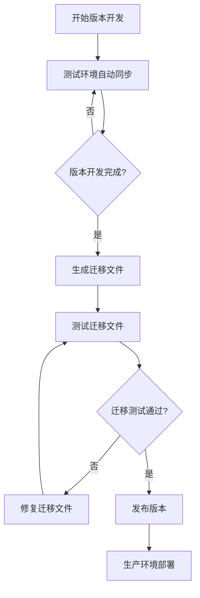

# TypeORM 字段迁移指南

本文档详细说明了在 TypeORM 中安全地修改业务字段的完整工作流程，特别是字段重命名等可能导致数据丢失的操作。

## 📋 目录

- [概述](#概述)
- [环境配置说明](#环境配置说明)
- [字段重命名工作流程](#字段重命名工作流程)
- [最佳实践方案](#最佳实践方案)
- [常见问题与解决方案](#常见问题与解决方案)
- [检查清单](#检查清单)

## 概述

在 TypeORM 中修改业务字段（如将 `name` 重命名为 `username`）需要谨慎处理，以避免数据丢失。本指南提供了安全的迁移策略和最佳实践。

## 环境配置说明

### 开发环境

```typescript
// typeorm.config.ts
synchronize: process.env.NODE_ENV === 'development', // true
```

- ✅ 自动同步表结构
- ⚠️ 可能导致数据丢失
- 适用于：测试数据、可重建数据

### 生产环境

```typescript
// typeorm.config.ts
synchronize: process.env.NODE_ENV !== 'development', // false
```

- ✅ 数据安全保护
- ✅ 需要迁移文件
- 适用于：生产数据、重要数据

## 字段重命名工作流程

### 示例场景

将 User 实体的 `name` 字段重命名为 `username`：

```typescript
// 原始实体
@Entity()
export class User {
  @PrimaryGeneratedColumn()
  id: number;

  @Column()
  name: string; // 要重命名的字段

  @Column()
  email: string;
}

// 目标实体
@Entity()
export class User {
  @PrimaryGeneratedColumn()
  id: number;

  @Column()
  username: string; // 重命名后的字段

  @Column()
  email: string;
}
```

### 生产环境安全流程

#### 步骤 1: 创建迁移文件

```bash
# 生成迁移文件
npx typeorm migration:generate -n RenameNameToUsername
```

#### 步骤 2: 手动编辑迁移文件

TypeORM 可能无法自动识别字段重命名，需要手动编辑：

```typescript
// src/migrations/xxx-RenameNameToUsername.ts
import { MigrationInterface, QueryRunner } from 'typeorm'

export class RenameNameToUsername1234567890 implements MigrationInterface {
  public async up(queryRunner: QueryRunner): Promise<void> {
    // 重命名列而不是删除+创建
    await queryRunner.renameColumn('user', 'name', 'username')
  }

  public async down(queryRunner: QueryRunner): Promise<void> {
    // 回滚操作
    await queryRunner.renameColumn('user', 'username', 'name')
  }
}
```

#### 步骤 3: 测试迁移

```bash
# 在测试环境执行迁移
npx typeorm migration:run

# 验证数据完整性
# 检查数据是否正确迁移

# 如需回滚
npx typeorm migration:revert
```

#### 步骤 4: 生产环境部署

```bash
# 1. 备份数据库
pg_dump your_database > backup.sql

# 2. 执行迁移
npx typeorm migration:run

# 3. 验证应用功能
# 4. 监控系统状态
```

## 最佳实践方案

### 方案 A: 渐进式迁移（推荐）

这是最安全的方案，分为两个阶段进行：

#### 第一阶段：添加新字段，保留旧字段

```typescript
@Entity()
export class User {
  @PrimaryGeneratedColumn()
  id: number;

  @Column({ nullable: true })
  name: string; // 保留旧字段

  @Column({ nullable: true })
  username: string; // 添加新字段

  @Column()
  email: string;
}
```

对应的迁移文件：

```typescript
// 迁移文件 - 第一阶段
export class AddUsernameColumn1234567890 implements MigrationInterface {
  public async up(queryRunner: QueryRunner): Promise<void> {
    // 1. 添加新列
    await queryRunner.addColumn(
      'user',
      new TableColumn({
        name: 'username',
        type: 'varchar',
        isNullable: true,
      }),
    )

    // 2. 复制数据
    await queryRunner.query(`UPDATE "user" SET "username" = "name"`)

    // 3. 设置新列为非空
    await queryRunner.changeColumn(
      'user',
      'username',
      new TableColumn({
        name: 'username',
        type: 'varchar',
        isNullable: false,
      }),
    )
  }

  public async down(queryRunner: QueryRunner): Promise<void> {
    await queryRunner.dropColumn('user', 'username')
  }
}
```

#### 第二阶段：删除旧字段（几个版本后）

```typescript
@Entity()
export class User {
  @PrimaryGeneratedColumn()
  id: number;

  @Column()
  username: string; // 只保留新字段

  @Column()
  email: string;
}
```

对应的迁移文件：

```typescript
// 第二阶段迁移文件
export class RemoveNameColumn1234567891 implements MigrationInterface {
  public async up(queryRunner: QueryRunner): Promise<void> {
    await queryRunner.dropColumn('user', 'name')
  }

  public async down(queryRunner: QueryRunner): Promise<void> {
    await queryRunner.addColumn(
      'user',
      new TableColumn({
        name: 'name',
        type: 'varchar',
        isNullable: true,
      }),
    )
    await queryRunner.query(`UPDATE "user" SET "name" = "username"`)
  }
}
```

### 方案 B: 直接重命名（风险较高）

```typescript
export class RenameNameToUsername1234567890 implements MigrationInterface {
  public async up(queryRunner: QueryRunner): Promise<void> {
    await queryRunner.renameColumn('user', 'name', 'username')
  }

  public async down(queryRunner: QueryRunner): Promise<void> {
    await queryRunner.renameColumn('user', 'username', 'name')
  }
}
```

**注意**: 此方案风险较高，建议仅在以下情况使用：

- 测试环境
- 数据量较小
- 有完整备份
- 可以接受短暂停机

## 常见问题与解决方案

### Q1: TypeORM 自动生成的迁移文件不正确怎么办？

**A**: TypeORM 可能将字段重命名识别为删除+创建操作，需要手动修改迁移文件使用 `renameColumn` 方法。

### Q2: 如何处理有外键约束的字段？

**A**: 需要先处理外键约束：

```typescript
public async up(queryRunner: QueryRunner): Promise<void> {
    // 1. 删除外键约束
    await queryRunner.dropForeignKey("table_name", "fk_constraint_name");

    // 2. 重命名字段
    await queryRunner.renameColumn("table_name", "old_name", "new_name");

    // 3. 重新创建外键约束
    await queryRunner.createForeignKey("table_name", new TableForeignKey({
        columnNames: ["new_name"],
        referencedTableName: "referenced_table",
        referencedColumnNames: ["id"]
    }));
}
```

### Q3: 如何处理索引？

**A**: 重命名字段后需要重建索引：

```typescript
public async up(queryRunner: QueryRunner): Promise<void> {
    // 1. 删除旧索引
    await queryRunner.dropIndex("table_name", "idx_old_name");

    // 2. 重命名字段
    await queryRunner.renameColumn("table_name", "old_name", "new_name");

    // 3. 创建新索引
    await queryRunner.createIndex("table_name", new TableIndex({
        name: "idx_new_name",
        columnNames: ["new_name"]
    }));
}
```

### Q4: 迁移失败如何回滚？

**A**: 使用 TypeORM 的回滚命令：

```bash
# 回滚最后一次迁移
npx typeorm migration:revert

# 查看迁移状态
npx typeorm migration:show
```

## 检查清单

### 迁移前检查

- [ ] 备份生产数据库
- [ ] 在测试环境验证迁移
- [ ] 更新所有相关代码引用
- [ ] 准备回滚计划
- [ ] 检查外键约束和索引
- [ ] 评估停机时间

### 迁移后检查

- [ ] 验证数据完整性
- [ ] 测试应用功能
- [ ] 监控系统性能
- [ ] 确认无业务影响
- [ ] 检查日志错误
- [ ] 验证数据一致性

### 代码更新检查

- [ ] 更新实体定义
- [ ] 更新 Repository 查询
- [ ] 更新 API 接口
- [ ] 更新前端代码
- [ ] 更新测试用例
- [ ] 更新文档

## 长期开发周期的迁移文件管理策略

### 问题场景

在长期开发周期中，测试环境使用 `synchronize: true`，数据库表结构始终与代码同步。这种情况下如何合理生成迁移文件？

### 推荐策略：版本发布前生成迁移文件

```bash
# 开发阶段：测试环境自动同步
NODE_ENV=development # synchronize: true

# 发布前：生成累积迁移文件
npx typeorm migration:generate -n Release_v1_2_0

# 生产部署：应用迁移文件
NODE_ENV=production # synchronize: false
npx typeorm migration:run
```

**推荐时机**：

- ✅ **版本发布前**：如 v1.2.0 发布前生成一个迁移文件
- 这是最佳实践，既保证了开发效率，又确保了生产环境的数据安全

### 具体实施流程

#### 1. 开发阶段配置

```typescript
// typeorm.config.ts - 开发环境
const developmentConfig = {
  synchronize: true, // 自动同步，快速开发
  logging: true, // 记录SQL，便于调试
  dropSchema: false, // 不要删除整个schema
}
```

#### 2. 版本发布前生成迁移文件



#### 3. 迁移文件命名规范

```bash
# 按版本命名（推荐）
npx typeorm migration:generate -n Release_v1_2_0
npx typeorm migration:generate -n Release_v1_3_0
npx typeorm migration:generate -n Release_v2_0_0
```

### 避免过多迁移文件的技巧

#### 版本发布前合并变更

```bash
# 推荐：版本发布前生成一个综合迁移文件
Release_v1_2_0.ts  # 包含整个版本的所有数据库变更
```

#### 手动创建综合迁移文件

```typescript
// 版本发布前，手动创建一个综合迁移文件
export class ReleaseV120_1234567890 implements MigrationInterface {
  public async up(queryRunner: QueryRunner): Promise<void> {
    // 合并整个版本的所有数据库变更

    // 用户表变更
    await queryRunner.addColumn(
      'user',
      new TableColumn({
        name: 'username',
        type: 'varchar',
      }),
    )

    // 订单表变更
    await queryRunner.addColumn(
      'order',
      new TableColumn({
        name: 'status',
        type: 'enum',
        enum: ['pending', 'completed', 'cancelled'],
      }),
    )

    // 索引变更
    await queryRunner.createIndex(
      'user',
      new TableIndex({
        name: 'idx_user_username',
        columnNames: ['username'],
      }),
    )
  }
}
```

#### 清理历史迁移文件

```bash
# 在主要版本发布后，可以考虑清理历史迁移文件
# 注意：只有在确保所有环境都已应用的情况下才能清理

# 1. 确保所有环境都是最新状态
npx typeorm migration:show

# 2. 创建一个新的基线迁移文件
npx typeorm migration:generate -n BaselineV2_0_0

# 3. 删除旧的迁移文件（谨慎操作）
```

### 实际工作流程示例

```bash
# 版本开发周期：v1.2.0 开发
# 测试环境自动同步，快速迭代开发

# 版本开发完成，准备发布
git checkout main

# 生成版本迁移文件
npx typeorm migration:generate -n Release_v1_2_0

# 测试迁移文件
npm run test:migration

# 发布版本
git tag v1.2.0

# 部署到生产环境
npx typeorm migration:run
```

## 推荐流程总结

### 版本发布前生成迁移文件的最佳实践：

1. **开发阶段**：使用 `synchronize: true`，快速迭代开发
2. **版本发布前**：生成累积迁移文件（包含整个版本的所有数据库变更）
3. **迁移测试**：在类生产环境测试迁移文件
4. **生产部署**：使用 `synchronize: false` + 迁移文件
5. **定期清理**：主要版本发布后考虑清理历史迁移文件

### 字段重命名的渐进式迁移：

1. **第一次部署**：添加 `username` 字段，保留 `name` 字段
2. **应用层适配**：逐步将代码从 `name` 迁移到 `username`
3. **观察期**：运行一段时间，确保系统稳定
4. **第二次部署**：删除 `name` 字段

这种方式既保证了开发效率，又确保了生产环境的数据安全和迁移文件的可管理性。

## 相关文档

- [TypeORM Migration 官方文档](https://typeorm.io/migrations)
